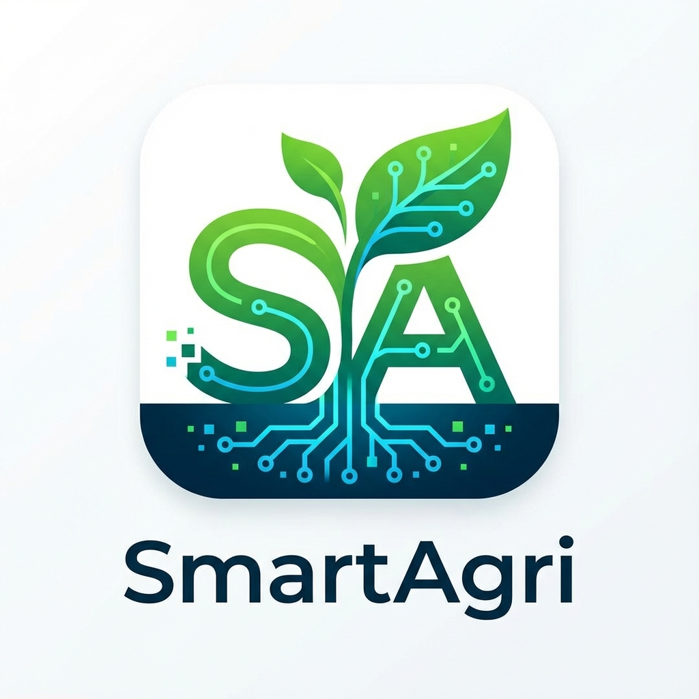
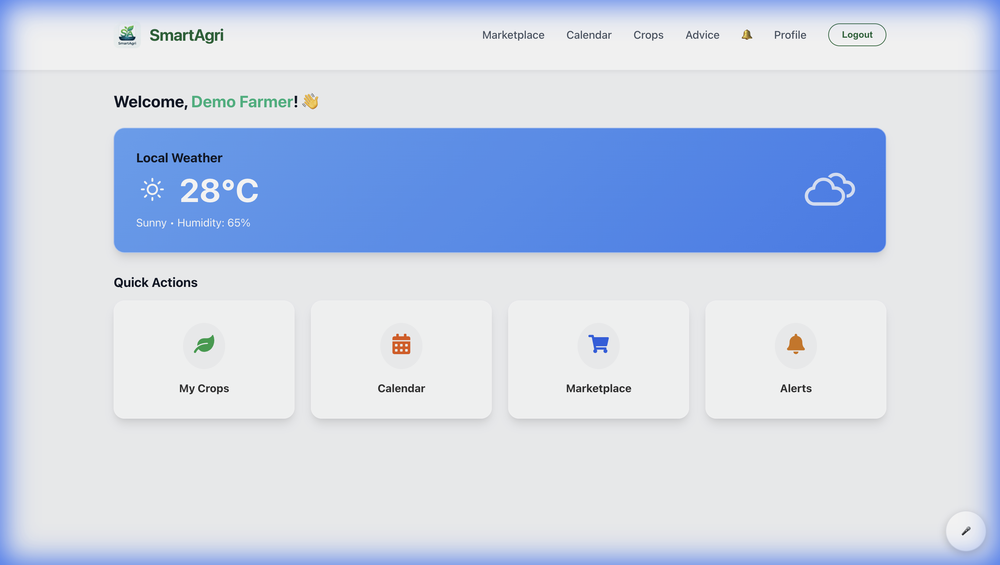
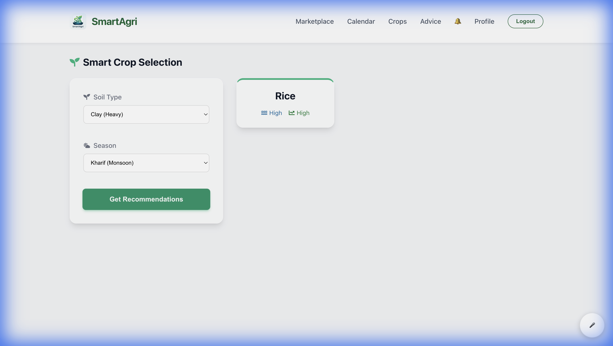
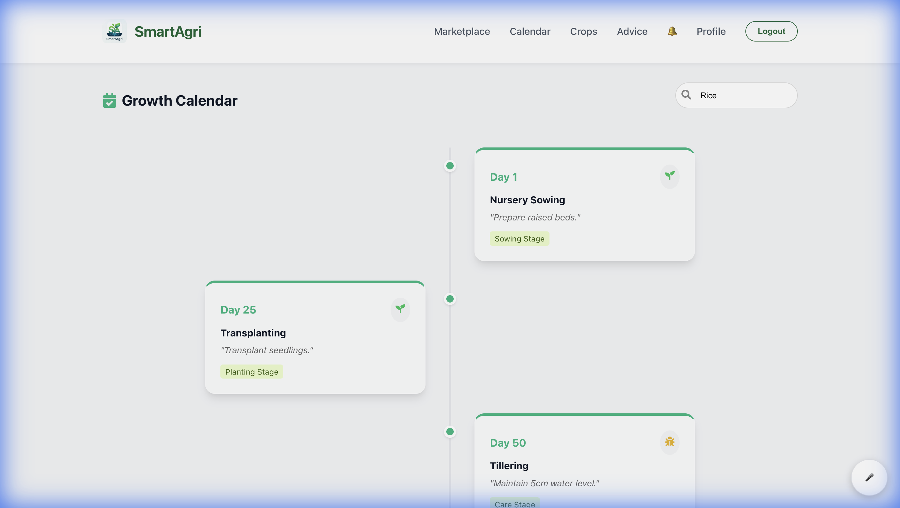
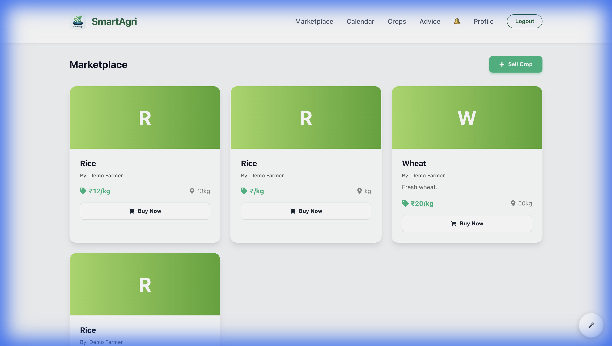
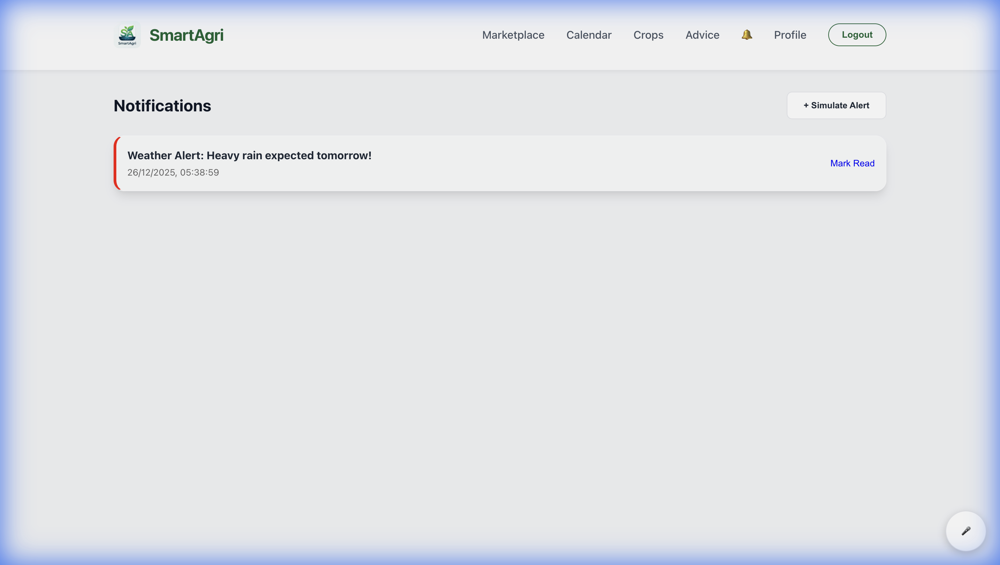

<div align="center">
  
  <h1>🌱 SmartAgri</h1>
  <p><strong>Intelligent Farm Management & Marketplace System</strong></p>

  <p>
    <a href="#-features">Features</a> •
    <a href="#-tech-stack">Tech Stack</a> •
    <a href="#-getting-started">Getting Started</a> •
    <a href="#-screenshots">Screenshots</a>
  </p>
</div>

---

## 📖 Overview
**SmartAgri** (formerly IFMMS) is a comprehensive digital solution designed to bridge the gap between farmers and technology. It empowers farmers with real-time crop advisory, a direct marketplace, and precision farming tools, while providing consumers with traceable, fresh produce.

The platform is built with a **Mobile-First** design philosophy, featuring large touch-friendly controls, voice assistance, and regional language support capabilities.

## ✨ Features

### 🚜 For Farmers
- **🌾 Smart Crop Selection**: AI-driven rule engine suggests crops based on **Soil Type** (Clay, Loamy, etc.) and **Season** (Kharif, Rabi).
- **📅 Growth Calendar**: Interactive **Vertical Timeline** tracking crop lifecycle from Sowing to Harvesting for 10+ major crops.
- **🌦️ Weather Widget**: Real-time dashboard with humidity, wind speed, and daily farming tips.
- **📢 Marketplace**: List crops for sale with custom pricing and quantity.
- **🎙️ Voice Assistant**: Integrated voice navigation and screen reader for accessibility.

### 🛒 For Consumers
- **🛍️ Direct Buying**: Purchase fresh produce directly from farmers avoiding middlemen.
- **🚚 GPS Tracking**: Real-time order tracking on an interactive map with delivery status timeline.
- **🔔 Notifications**: Order updates and alerts.

### 🔐 Security & UX
- **Role-Based Access**: Distinct interfaces for Farmers and Consumers.
- **Glassmorphism UI**: Modern, premium aesthetic with `framer-motion` animations.
- **Secure Auth**: JWT-based authentication with OTP verification (Mock).

## 🛠 Tech Stack

### **Frontend**


### **Backend**


### **Middleware & Services**


## 📂 Project Structure

```bash
SmartAgri/
├── BackEnd/
│   ├── config/         # SQLite DB connection & seeding
│   ├── routes/         # API Endpoints (Auth, Crops, GPS)
│   └── server.js       # Main entry point
├── frontend/
│   ├── public/         # Static assets (logo.png)
│   ├── src/
│   │   ├── components/ # Navbar, VoiceAssistant
│   │   ├── pages/      # Dashboard, Marketplace, Calendar
│   │   └── App.jsx     # Routing & Role Logic
│   └── index.html      # Entry HTML
└── README.md
```

## 🚀 Getting Started

### Prerequisites
- Node.js (v14 or higher)
- npm

### 1. Clone the Repository
```bash
git clone https://github.com/HemachandRavulapalli/CSP.git
cd CSP
```

### 2. Setup Backend
```bash
cd BackEnd
npm install
node server.js
```
*The server will start on port 3000 and automatically seed the SQLite database.*

### 3. Setup Frontend
Open a new terminal:
```bash
cd frontend
npm install
npm run dev
```
*The app will run at `http://localhost:5173`.*

## 📸 Screenshots

<div align="center">
  <h3>Interactive Dashboard</h3>
  
</div>

<br/>

<div align="center">
  
  
</div>
<div align="center">
  <p><em>Smart Crop Recommendation & Vertical Growth Timeline</em></p>
</div>

<br/>

<div align="center">
  <h3>Digital Marketplace</h3>
  
</div>

<br/>

<div align="center">
  <h3>Live GPS Tracking</h3>
  
</div>

## 🤝 Contributing
Contributions are welcome! Please fork the repository and create a pull request.

## 📄 License
This project is licensed under the MIT License.
